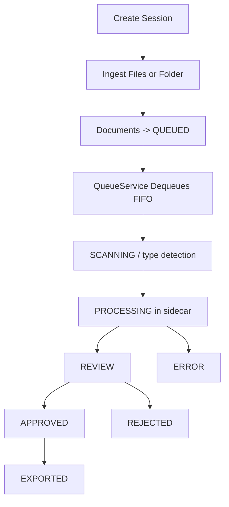

# OltekOCR Desktop

OltekOCR Desktop is an offline-first logistics document processing application built for desktop workflows. It ingests files, runs OCR/extraction locally, supports operator review, and exports approved results to Excel/CSV/JSON.

## What It Does

- Runs fully local on your machine (no cloud dependency for core processing).
- Supports multiple extraction modes: OCR, table/field extraction, and PDF contract extraction.
- Processes files through a FIFO queue with pause/resume/cancel.
- Streams live processing status to the UI through WebSocket updates.
- Provides review workflows (approve/reject/reprocess) before export.
- Stores runtime data in local SQLite via Prisma.

## Tech Stack

| Layer                       | Technology                                                                                      |
| --------------------------- | ----------------------------------------------------------------------------------------------- |
| Desktop shell               | Electron 28                                                                                     |
| Frontend                    | React 18 + TypeScript + React Router + Vite                                                     |
| UI                          | TailwindCSS v3 + Radix UI + shadcn patterns                                                     |
| Backend (in-process)        | NestJS v10 (embedded in Electron main process)                                                  |
| Realtime                    | WebSocket (`ws`) via `@nestjs/platform-ws`                                                      |
| Database                    | SQLite + Prisma ORM                                                                             |
| OCR sidecar                 | Python + RapidOCR (`ocr_rapidocr.py`)                                                           |
| PDF extraction sidecar      | Python dispatcher (`pdf_extract.py`) with `docling` / `pdfplumber` / `pymupdf` / `unstructured` |
| Contract extraction sidecar | Python (`pdf_contract_extract_dynamic.py` / `pdf_contract_extract.py`)                          |
| TABLE_EXTRACT QA sidecar    | Python + Ollama (`qa_ollama.py`)                                                                |

## Architecture

```text
Electron Main Process
  |- NestJS API server: http://localhost:3847/api
  |- WebSocket gateway: ws://localhost:3847/ws
  |- Prisma -> SQLite (./data/oltekocr.db)
  |- Python sidecars spawned per processing task

Electron Renderer (React)
  |- Calls REST API on localhost:3847/api
  |- Subscribes to WebSocket events for queue/doc updates
```

### Core Backend Modules

| Module                | Responsibility                                             |
| --------------------- | ---------------------------------------------------------- |
| `sessions`            | Session CRUD, ingestion, mode/schema management            |
| `documents`           | Document CRUD, serving source files/thumbnails, status ops |
| `queue`               | FIFO processing orchestration, pause/resume/cancel         |
| `ocr`                 | OCR routing and sidecar orchestration                      |
| `contract-extraction` | PDF contract extraction pipeline                           |
| `extraction`          | TABLE_EXTRACT field answering via Ollama sidecar           |
| `scanner`             | Folder watching / scanner stub endpoints                   |
| `export`              | Export selected or all approved docs to Excel/CSV/JSON     |
| `settings`            | Persistent app settings in `data/settings.json`            |
| `models`              | PDF/Ollama model status + install helpers                  |

## End-to-End Flow



### Runtime Status Lifecycle

- `QUEUED`: waiting in queue
- `SCANNING`: pre-processing / extraction type detection
- `PROCESSING`: OCR or extraction in progress
- `CANCELLING`: transitional state while cancel request is handled
- `REVIEW`: processed, waiting for operator decision
- `APPROVED`: accepted for export
- `REJECTED`: rejected by reviewer
- `EXPORTED`: exported to output file
- `ERROR`: pipeline failed

On startup, transient statuses (`CANCELLING`, `SCANNING`, `PROCESSING`) are recovered back to `QUEUED`.

## Session Modes

| Mode            | Purpose                                              | Main Processor                                          |
| --------------- | ---------------------------------------------------- | ------------------------------------------------------- |
| `OCR_EXTRACT`   | OCR text extraction for images/scanned PDFs          | `ocr_rapidocr.py` or routed PDF extractor               |
| `TABLE_EXTRACT` | Answer user-defined field questions from OCR text    | OCR pipeline + `qa_ollama.py`                           |
| `PDF_EXTRACT`   | Structured logistics PDF contract extraction         | `contract-extraction` service + python contract sidecar |
| `JSON_EXTRACT`  | Reserved mode (currently mocked in new-session flow) | Not production-wired yet                                |

## Frontend Routes

| Route               | View                              |
| ------------------- | --------------------------------- |
| `/`                 | Sessions home (PDF extract focus) |
| `/ocr-extract`      | Sessions home for OCR mode        |
| `/keyword-extract`  | Sessions home for TABLE mode      |
| `/pdf-sessions/:id` | PDF session detail                |
| `/sessions/:id`     | General session detail            |

## Requirements

### Required

- Windows 10/11 recommended (project is Windows-first).
- Node.js 18+.
- npm 9+.
- Python 3.10 to 3.13.

### Optional by Feature

- Ollama running locally for `TABLE_EXTRACT`.
- Additional Python packages depending on extraction model.

## Installation and Setup

### 1. Clone

```bash
git clone https://github.com/One-Team-One-Goal/oltekocr-desktop.git
cd oltekocr-desktop
```

### 2. Install Node dependencies

```bash
npm install
```

`postinstall` runs `electron-builder install-app-deps` automatically.

### 3. Create Python virtual environment

#### Windows (recommended)

```powershell
python -m venv .venv
.\.venv\Scripts\Activate.ps1
python -m pip install --upgrade pip setuptools wheel
```

#### macOS/Linux (note)

```bash
python3 -m venv .venv
source .venv/bin/activate
python -m pip install --upgrade pip setuptools wheel
```

### 4. Install Python sidecar dependencies

#### Minimum (OCR_EXTRACT)

```bash
pip install rapidocr-onnxruntime pymupdf
```

#### PDF extraction models

```bash
pip install pdfplumber pymupdf
```

Optional model backends:

```bash
pip install docling unstructured
```

#### TABLE_EXTRACT prerequisites

`qa_ollama.py` uses the local Ollama HTTP API. Install/run Ollama and pull at least one model:

```bash
ollama serve
ollama pull qwen2.5:7b
```

You can select model/version from the app settings/models UI.

Current behavior note: `TABLE_EXTRACT` execution is handled through the Ollama sidecar (`qa_ollama.py`).

### 5. Initialize database

```bash
npx prisma generate
npx prisma db push
```

This creates `data/oltekocr.db` if it does not exist.

### 6. Run in development

```bash
npm run dev
```

This starts Electron and the embedded NestJS server on port `3847`.

### 7. Build installer

```bash
npm run build
```

Packaged artifacts are written under `dist/`.

## Runtime Directories

Created automatically under `data/`:

```text
data/
  oltekocr.db
  settings.json
  scans/
    incoming/
    thumbnails/
  exports/
```

## API and WebSocket Surface

Base URL: `http://localhost:3847/api`

### Sessions

- `POST /sessions`
- `GET /sessions`
- `GET /sessions/:id`
- `POST /sessions/:id/duplicate`
- `PATCH /sessions/:id/columns`
- `PATCH /sessions/:id/rename`
- `PATCH /sessions/:id/extraction-model`
- `DELETE /sessions/:id`
- `POST /sessions/:id/ingest/files`
- `POST /sessions/:id/ingest/folder`
- `GET /sessions/:id/documents`
- `GET /sessions/:id/stats`
- `GET /sessions/schema-presets`
- `POST /sessions/schema-presets`

### Documents

- `GET /documents`
- `GET /documents/stats`
- `GET /documents/:id`
- `GET /documents/:id/image`
- `GET /documents/:id/thumbnail`
- `POST /documents/load`
- `POST /documents/load-folder`
- `POST /documents/analyze-pdf-content`
- `POST /documents/extract-pdf-text`
- `PATCH /documents/:id`
- `PATCH /documents/:id/approve`
- `PATCH /documents/:id/reject`
- `PATCH /documents/:id/reprocess`
- `DELETE /documents/:id`

### Queue

- `GET /queue/status`
- `POST /queue/add`
- `POST /queue/pause`
- `POST /queue/resume`
- `POST /queue/cancel`
- `DELETE /queue`

### Export

- `POST /export`
- `POST /export/all-approved`
- `GET /export/history`

### Settings and Scanner

- `GET /settings`
- `GET /settings/defaults`
- `PATCH /settings`
- `GET /scanner/list`
- `POST /scanner/scan`
- `POST /scanner/watch/start`
- `POST /scanner/watch/stop`
- `GET /scanner/watch/status`

### WebSocket

- Endpoint: `ws://localhost:3847/ws`
- Events:
  - `queue:update`
  - `document:status`
  - `processing:progress`
  - `processing:log`

Swagger/OpenAPI docs are available at `http://localhost:3847/api/docs` while the app is running.

## Default Settings Snapshot

```json
{
  "scanner": {
    "watchFolder": "./data/scans/incoming"
  },
  "ocr": {
    "engine": "rapidocr",
    "pdfModel": "pdfplumber",
    "confidenceThreshold": 85,
    "timeout": 120,
    "pythonPath": "python"
  },
  "export": {
    "defaultFormat": "excel"
  },
  "llm": {
    "provider": "groq",
    "defaultModel": "qwen3:30b"
  }
}
```

## Development Commands

```bash
npm run dev
npm run build
npm run preview
npm run typecheck:node
npm run typecheck:web
npm run prisma:generate
npm run prisma:push
npm run prisma:studio
```

## Troubleshooting

- Python not found or OCR sidecar fails:
  - Activate the virtual environment.
  - Set OCR python path in settings to the exact interpreter path.
- `TABLE_EXTRACT` returns errors:
  - Ensure `ollama serve` is running and selected model is installed.
- `pdf_extract.py` model import errors:
  - Install the package for that model (`pdfplumber`, `pymupdf`, `docling`, `unstructured`).
- Prisma/client mismatch:
  - Run `npx prisma generate` then `npx prisma db push`.
- Port conflict on `3847`:
  - Stop existing process using the port and restart app.

## Notes for Hackathon Evaluators

- The application is designed for local desktop execution.
- Queue processing is intentionally sequential for predictable resource usage.
- `JSON_EXTRACT` mode is present in types/UI but is not yet a production-complete pipeline.

## License

MIT
